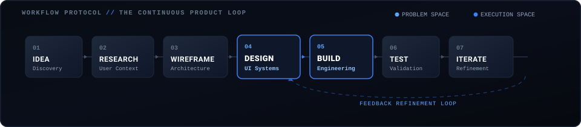

  <!-- HERO BANNER -->
  

   
   

  <!-- STATUS BADGE BAR -->
  

    <code>FOCUS: PRODUCT DESIGN & SOFTWARE ARCHITECTURE</code> &nbsp;•&nbsp;
    <code>STATUS: BUILDING REAL-WORLD IMPACT</code> &nbsp;•&nbsp;
    <code>BASE: NIGERIA / REMOTE</code>
  

---

### &nbsp; 01 // OVERVIEW

> **"Code determines whether software runs. Thoughtful design determines whether it matters. I work at the convergence—interrogating the real problem, architecting intuitive systems, and engineering clean, accessible software that solves tangible human needs."**

I am **Mubarak Adeleke** (*OneNerd*), a **Product Designer and Developer**. I don't treat design and engineering as opposing disciplines—I approach them as a unified product engine. From early-stage problem framing and high-fidelity design systems to modular frontend code and native Android applications, I turn ambiguous ideas into functional, purposeful digital products.

 

---

### &nbsp; 02 // SELECTED WORK

A curated selection of projects demonstrating end-to-end product thinking, user experience design, and technical execution.

<table width="100%">
  <tr>
    <td width="50%" valign="top">
      <h3>🌱 RecyConnect</h3>
      
<b>Circular Economy & Digital Waste Incentive System</b>

      

        A technology-driven sustainability platform designed to incentivize community waste collection, streamline recycling logistics, and reward eco-conscious habits through transparent digital tracking.
      

      

        <b>Problem Solved:</b> Low household recycling participation caused by friction in collection schedules and lack of immediate incentives. 
        <b>Design Focus:</b> Low-friction reporting flow, transparent reward accounting, and high-contrast mobile readability for diverse users.
      

      

        <code>Android</code> • <code>Kotlin</code> • <code>Figma</code> • <code>Design Systems</code> • <code>REST APIs</code>
      

      

        <kbd>STATUS: BUILDING</kbd> &nbsp;
        <a href="https://github.com/adeleke-mubarak/RecyConnect"><b>View Project Repository →</b></a>
      

    </td>
    <td width="50%" valign="top">
      <h3>🏛️ CouncilDesk Naija</h3>
      
<b>Civic Accountability & Local Governance Interface</b>

      

        A civic-tech interface facilitating transparent communication between citizens and grassroots municipal governance, streamlining public feedback, issue tracking, and community service resolution.
      

      

        <b>Problem Solved:</b> The disconnect between urban citizens and municipal councils regarding local infrastructure maintenance. 
        <b>Design Focus:</b> Accessible form hierarchies, clear ticket status signposting, and resilient offline-friendly workflows.
      

      

        <code>Product Thinking</code> • <code>Frontend Architecture</code> • <code>JavaScript</code> • <code>UI/UX</code>
      

      

        <kbd>STATUS: BUILDING</kbd> &nbsp;
        <a href="https://github.com/adeleke-mubarak/CouncilDesk-Naija"><b>View Project Repository →</b></a>
      

    </td>
  </tr>
  <tr>
    <td width="50%" valign="top">
      <h3>📄 Resume Builder</h3>
      
<b>Typographic Document Generator & Layout Engine</b>

      

        An interactive developer and professional tool for drafting, structuring, and previewing high-fidelity resumes with instant typographic scaling, schema validation, and ATS-optimized export.
      

      

        <b>Problem Solved:</b> Clunky document formatters that break typographic hierarchy and output poorly parsed PDF structures. 
        <b>Design Focus:</b> Real-time split-screen editing with live layout previews and strict visual hierarchy guidelines.
      

      

        <code>Frontend Engineering</code> • <code>DOM Layout</code> • <code>JavaScript</code> • <code>CSS Architecture</code>
      

      

        <kbd>STATUS: EXPERIMENT</kbd> &nbsp;
        <a href="https://github.com/adeleke-mubarak/resume-builder"><b>View Project Repository →</b></a>
      

    </td>
    <td width="50%" valign="top">
      <h3>🤝 Elite Techies</h3>
      
<b>Collaborative Knowledge Network & Resource Hub</b>

      

        A structured community platform designed to connect emerging developers and creators with vetted roadmaps, shared tooling libraries, and peer project feedback loops.
      

      

        <b>Problem Solved:</b> Information overload and fragmented guidance for early-career developers entering the industry. 
        <b>Design Focus:</b> Curated category discovery, high-density resource cards, and intuitive navigation paradigms.
      

      

        <code>UI/UX Design</code> • <code>Frontend Engineering</code> • <code>CSS Grid</code> • <code>Community Architecture</code>
      

      

        <kbd>STATUS: PROTOTYPE</kbd> &nbsp;
        <a href="https://github.com/adeleke-mubarak/Elite-Techies"><b>View Project Repository →</b></a>
      

    </td>
  </tr>
</table>

 

---

### &nbsp; 03 // CURRENTLY BUILDING & EXPERIMENTS

Ongoing builds, interactive mechanics, and prototype explorations.

<table width="100%">
  <thead>
    <tr>
      <th align="left" width="28%">Project</th>
      <th align="left" width="42%">Core Description</th>
      <th align="left" width="18%">Stack</th>
      <th align="center" width="12%">Status</th>
    </tr>
  </thead>
  <tbody>
    <tr>
      <td><b>RecyConnect</b></td>
      <td>Incentivized recycling and waste management system for communities.</td>
      <td><code>Kotlin</code> <code>Android</code> <code>Figma</code></td>
      <td align="center"><kbd>Building</kbd></td>
    </tr>
    <tr>
      <td><b>CouncilDesk Naija</b></td>
      <td>Civic engagement platform tracking municipal queries and resolution.</td>
      <td><code>JS</code> <code>Frontend</code> <code>UI/UX</code></td>
      <td align="center"><kbd>Building</kbd></td>
    </tr>
    <tr>
      <td><b>Resume Builder</b></td>
      <td>Structured dynamic document generator with live layout formatting.</td>
      <td><code>JavaScript</code> <code>CSS3</code> <code>HTML5</code></td>
      <td align="center"><kbd>Experiment</kbd></td>
    </tr>
    <tr>
      <td><b>Elite Techies</b></td>
      <td>Community resource and collaborative workspace for creators.</td>
      <td><code>Frontend</code> <code>UI/UX</code> <code>Systems</code></td>
      <td align="center"><kbd>Prototype</kbd></td>
    </tr>
    <tr>
      <td><b>Match-Three Game</b></td>
      <td>Interactive grid logic game focusing on fluid state transitions & motion.</td>
      <td><code>JavaScript</code> <code>CSS Animation</code></td>
      <td align="center"><kbd>Completed</kbd></td>
    </tr>
    <tr>
      <td><b>Runner Game</b></td>
      <td>2D arcade runner featuring custom collision loops & physics controls.</td>
      <td><code>JavaScript</code> <code>Canvas / DOM</code></td>
      <td align="center"><kbd>Completed</kbd></td>
    </tr>
  </tbody>
</table>

 

---

### &nbsp; 04 // DESIGN + DEVELOPMENT CONTINUUM

I treat design and development as an uninterrupted feedback loop. Design informs architecture; engineering constraints refine design.

  

 

<table width="100%">
  <tr>
    <td width="50%" valign="top">
      <h4>🎯 Problem Space (Design Intent)</h4>
      <ul>
        <li><b>Discovery & Context:</b> Isolating the root human problem before deciding on solutions.</li>
        <li><b>Information Architecture:</b> Structuring flows, content hierarchies, and mental models.</li>
        <li><b>Design Systems:</b> Crafting scalable tokens, component libraries, and ergonomic interfaces in Figma.</li>
      </ul>
    </td>
    <td width="50%" valign="top">
      <h4>⚡ Execution Space (Technical Craft)</h4>
      <ul>
        <li><b>Interface Engineering:</b> Translating designs into responsive, accessible HTML, CSS, and modern JavaScript.</li>
        <li><b>Mobile Systems:</b> Architecting robust Android applications with Kotlin and modern patterns.</li>
        <li><b>Rapid Iteration:</b> Validating usability with real inputs, profiling performance, and refining details.</li>
      </ul>
    </td>
  </tr>
</table>

 

---

### &nbsp; 05 // TOOLKIT

A curated index of tools and technologies I use to design, build, and deploy digital products.

<table width="100%">
  <tr>
    <th width="25%" align="left">🎨 DESIGN</th>
    <th width="25%" align="left">💻 DEVELOPMENT</th>
    <th width="25%" align="left">💡 PRODUCT</th>
    <th width="25%" align="left">🛠️ TOOLS</th>
  </tr>
  <tr>
    <td valign="top">
      • <b>Figma</b> 
      • UI / UX Design 
      • Interactive Prototyping 
      • Design Systems 
      • Wireframing & Layout
    </td>
    <td valign="top">
      • <b>HTML5 & CSS3</b> 
      • JavaScript (ES6+) 
      • Python 
      • Kotlin 
      • Android SDK 
      • Responsive Web
    </td>
    <td valign="top">
      • <b>Product Thinking</b> 
      • User Research 
      • Rapid Prototyping 
      • Usability Testing 
      • Problem Framing
    </td>
    <td valign="top">
      • <b>Git & GitHub</b> 
      • Android Studio 
      • VS Code 
      • Google Antigravity 
      • Terminal & CLI
    </td>
  </tr>
</table>

 

---

### &nbsp; 06 // NOW

What is currently on my radar and receiving focused attention:

- **Learning:** Deepening native Android architectural patterns, Jetpack state machines, and declarative UI.
- **Building:** The core MVP and interaction model for **RecyConnect** to streamline local recycling loops.
- **Exploring:** Design-to-code bridges, micro-interactions, and offline-first mobile synchronization.
- **Designing:** Governance feedback workflows and design system primitives for **CouncilDesk Naija**.

*(Updated periodically to reflect active priorities)*

 

---

### &nbsp; 07 // CONTRIBUTIONS & ACTIVITY

A visual cadence of continuous experimentation, engineering commits, and product iteration.

  <picture>
    <source media="(prefers-color-scheme: dark)" srcset="assets/github-contribution-grid-snake-dark.svg" />
    <source media="(prefers-color-scheme: light)" srcset="assets/github-contribution-grid-snake.svg" />
    
  </picture>

 

  <table width="100%">
    <tr>
      <td width="50%" align="center">
        
      </td>
      <td width="50%" align="center">
        
      </td>
    </tr>
  </table>

 

---

### &nbsp; 08 // CONNECT & COLLABORATE

I'm always open to discussing digital product opportunities, design systems, frontend/mobile challenges, and tech for social impact.

<table width="100%">
  <tr>
    <td align="center" width="25%">
      <b>LinkedIn</b> 
      <a href="https://www.linkedin.com/in/adeleke-mubarak/">linkedin.com/in/adeleke-mubarak</a>
    </td>
    <td align="center" width="25%">
      <b>GitHub</b> 
      <a href="https://github.com/adeleke-mubarak">@adeleke-mubarak</a>
    </td>
    <td align="center" width="25%">
      <b>Portfolio</b> 
      <a href="https://github.com/adeleke-mubarak">[Portfolio Link / Coming Soon]</a>
    </td>
    <td align="center" width="25%">
      <b>Email</b> 
      <a href="mailto:contact@adeleke-mubarak.dev">[contact@adeleke-mubarak.dev]</a>
    </td>
  </tr>
</table>

 

  Designed with intention & built with code • <b>Mubarak Adeleke (OneNerd)</b> • 2026

